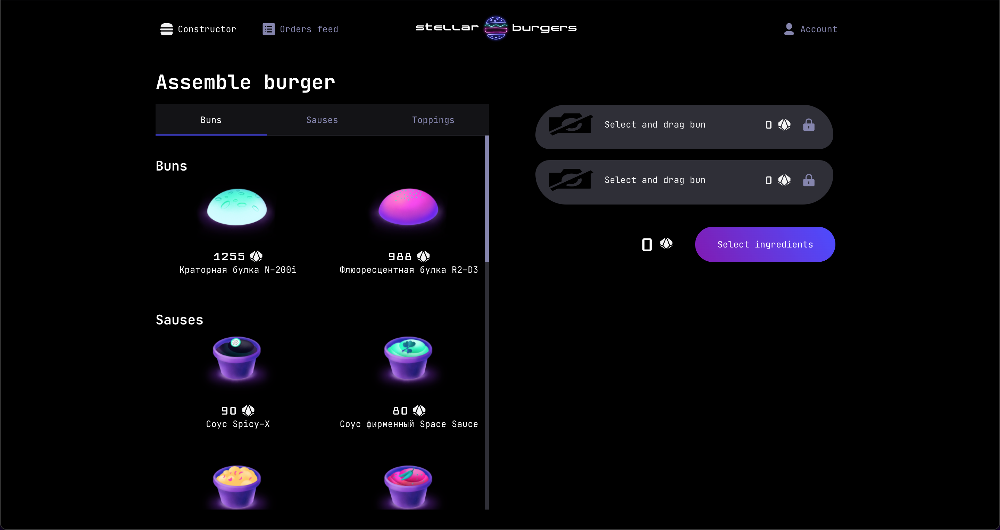
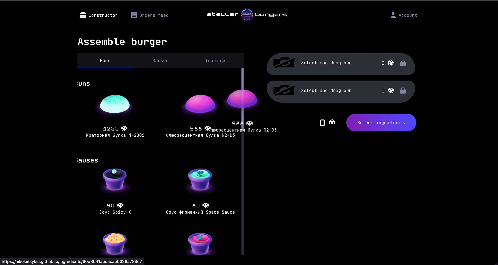
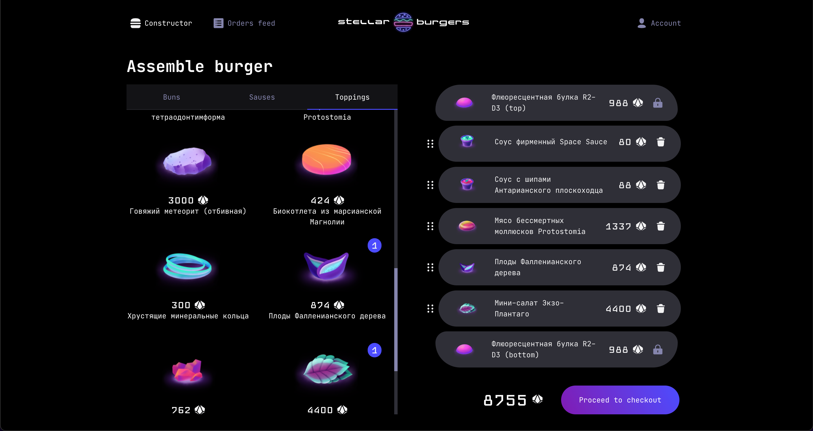
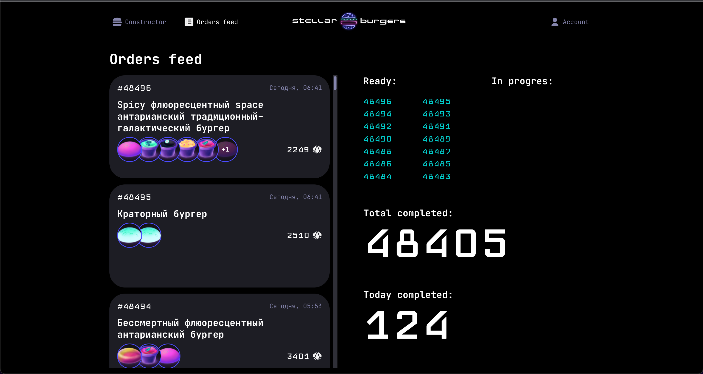
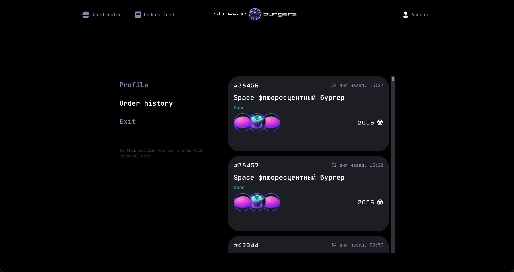

Project  "Stellar Burger" project application was written with the following technology stack: TypeScript, React, Redux, Redux-Toolkit, Websockets, React-dnd, testing - Jest and Cypress.

Deployment: 
## https://nikolaitsykin.github.io/react-burger/

This project is in Russian localization because of APIs I used, but Google translate can easily do the trick.

All starts with a 404 page because otherwise, you won't see it on github pages(routing is not working correctly). Press the button in the middle or use navigation bar in the Header.

The main page

You should drag the ingredients to fill the burger constructor

The main page with a burger constructor

The orders feed page

The authorized user's profile page with his order feed
